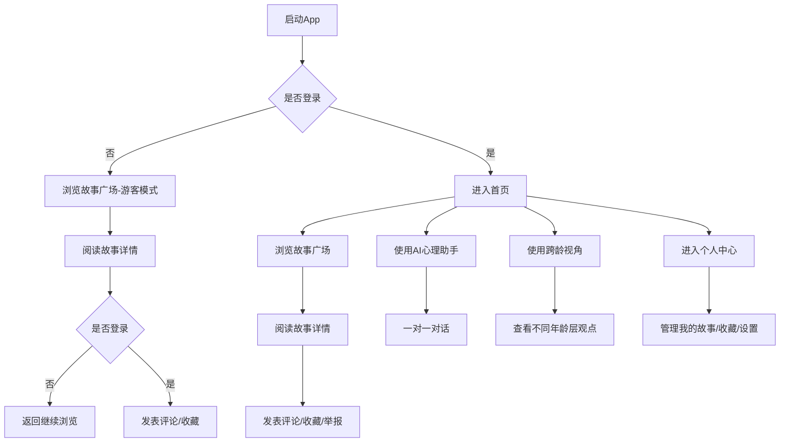
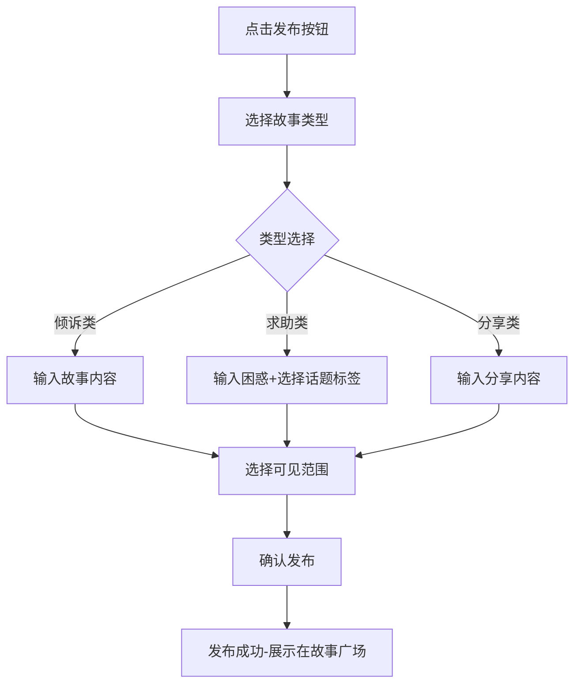

# 心理治疗室 - 产品需求文档

## 1. 产品概述

**项目名称**：心理治疗室

**项目简介**：一款以匿名故事社区为核心、AI心理助手为辅助的移动端应用，旨在打破代际隔阂与身份隔阂，让每个人都能走进别人的故事里，获得理解与共鸣。

**核心价值**：
- 为用户提供安全、温暖的匿名倾诉空间
- 通过"跨龄视角"功能促进不同年龄层之间的理解
- 用真实故事连接陌生人，构建互助网络

**目标用户**：
- 青少年（12-22岁）：学业压力、亲子冲突、自我认同
- 职场人群（22-40岁）：工作压力、情感困惑、人生迷茫
- 父母群体（30-55岁）：育儿焦虑、理解孩子、获得支持
- 中老年群体（55岁+）：孤独感、代际隔阂、健康焦虑

---

## 2. 核心功能模块

### 2.1 用户角色

| 角色 | 注册方式 | 核心权限 |
|------|----------|----------|
| 游客 | 无需注册 | 浏览故事广场、查看AI助手介绍 |
| 注册用户 | 手机号/匿名昵称 | 发布故事、评论互动、AI助手深度对话 |

### 2.2 功能模块列表

1. **故事广场** - 匿名发布自己的故事、困惑与心声，像帖子一样被社区看见
2. **互助社区** - 浏览他人的故事，留言安慰、分享经验、提供建议
3. **AI心理助手** - 当用户需要一对一倾诉时，提供共情回应与专业疏导
4. **跨龄视角** - 平台特色功能，展示不同年龄层用户对同一话题的观点
5. **个人中心** - 管理已发布的故事、收藏、设置

### 2.3 页面结构

| 页面名称 | 模块名称 | 功能描述 |
|----------|----------|----------|
| 首页/故事广场 | 故事列表 | 瀑布流展示所有匿名故事，支持筛选（最新/最热/关注话题） |
| 首页/故事广场 | 发布入口 | 悬浮按钮，点击展开故事发布表单 |
| 故事详情页 | 故事内容 | 展示故事正文、发布时间、标签 |
| 故事详情页 | 评论互动 | 展示评论列表，输入评论 |
| AI助手页 | 对话界面 | 与AI进行一对一倾诉对话 |
| 跨龄视角页 | 话题视角 | 展示不同年龄层对同一话题的观点 |
| 个人中心 | 我的故事 | 管理已发布的故事 |
| 个人中心 | 我的收藏 | 收藏的故事列表 |
| 个人中心 | 设置 | 隐私设置、通知设置 |

---

## 3. 核心流程

### 3.1 用户主流程

### 3.2 故事发布流程

---

## 4. 用户界面设计

### 4.1 设计风格

**整体调性**：温暖、治愈、安全感

**色彩方案**：
- 主色调：柔和蓝绿色 `#7FBEAB`（平静、治愈）
- 辅助色：暖米色 `#F5F0E8`（温暖、舒适）
- 强调色：温柔橙 `#E8A87C`（希望、关怀）
- 背景色：浅灰白 `#FAFAF8`（干净、安全）
- 文字色：深灰 `#3D3D3D`（易读、不刺眼）

**字体选择**：
- 标题：思源宋体 / Noto Serif SC（文化感、沉稳）
- 正文：思源黑体 / Noto Sans SC（清晰、易读）

**按钮风格**：圆角卡片式，柔和阴影

**布局风格**：底部导航 + 卡片式内容展示

**图标风格**：线性图标，圆润友好

### 4.2 页面设计概览

| 页面名称 | 模块名称 | 视觉风格 |
|----------|----------|----------|
| 首页 | 顶部导航栏 | 白色背景，品牌logo，搜索图标 |
| 首页 | 故事卡片 | 白色卡片，圆角12px，轻阴影，卡片内头像匿名化 |
| 故事详情页 | 故事头部 | 故事内容居中，发布时间右对齐，标签在底部 |
| AI助手页 | 对话界面 | 气泡式对话，用户气泡右对齐浅绿色，AI气泡左对齐白色 |
| 跨龄视角页 | 年龄层切换 | 顶部Tab切换：青少年/职场人/父母/中老年 |
| 个人中心 | 设置列表 | 列表项左侧图标，右侧箭头 |

### 4.3 响应式设计

- 移动端优先设计
- 触摸优化：按钮最小点击区域48x48px
- 底部导航栏固定，高度56px

---

## 5. 技术需求说明

### 5.1 前端技术要求

- 框架：React 18 + TypeScript
- 构建工具：Vite
- 样式方案：Tailwind CSS
- 路由：React Router v6
- 状态管理：React Context / Zustand

### 5.2 数据需求

- 使用 Mock 数据进行前端开发
- 故事数据包含：标题、内容、类型、标签、发布时间、评论数、点赞数
- AI对话使用预设回复模板模拟

---

## 6. 验收标准

1. 故事广场能够正常展示故事列表
2. 用户可以匿名发布故事
3. 故事详情页能够展示完整内容和评论
4. AI助手能够进行基础对话回应
5. 跨龄视角页面能够展示不同年龄层的观点
6. 个人中心能够管理故事和收藏
7. 移动端适配良好，交互流畅
