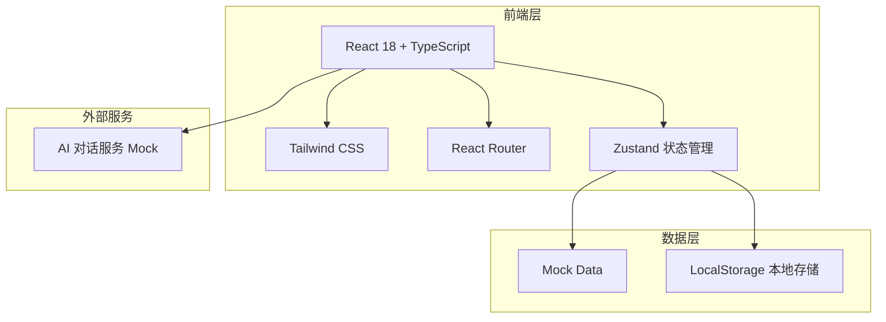

# 心理治疗室 - 技术架构文档

## 1. 架构设计



**架构说明**：
- 采用单页应用（SPA）架构
- 前端独立完成所有业务逻辑
- 数据使用本地Mock数据模拟
- AI对话使用预设回复模板

---

## 2. 技术选型

| 类别 | 技术 | 版本 |
|------|------|------|
| 框架 | React | 18.x |
| 语言 | TypeScript | 5.x |
| 构建工具 | Vite | 5.x |
| 样式方案 | Tailwind CSS | 3.x |
| 路由 | React Router | 6.x |
| 状态管理 | Zustand | 4.x |
| 图标 | Lucide React | 最新 |
| 字体 | Google Fonts (Noto Sans SC, Noto Serif SC) | - |

---

## 3. 路由定义

| 路由 | 页面名称 | 功能描述 |
|------|----------|----------|
| `/` | 首页/故事广场 | 展示故事列表，支持筛选 |
| `/story/:id` | 故事详情页 | 展示故事内容和评论 |
| `/ai-assistant` | AI心理助手 | 一对一对话界面 |
| `/cross-age` | 跨龄视角 | 不同年龄层观点展示 |
| `/profile` | 个人中心 | 用户管理页面 |
| `/profile/stories` | 我的故事 | 管理的已发布故事 |
| `/profile/collections` | 我的收藏 | 收藏的故事列表 |
| `/profile/settings` | 设置 | 隐私和通知设置 |
| `/publish` | 发布故事 | 发布新故事表单 |

---

## 4. 数据模型

### 4.1 故事数据模型

```typescript
interface Story {
  id: string;
  title: string;
  content: string;
  type: 'share' | 'vent' | 'help';
  tags: string[];
  author: {
    nickname: string;
    ageGroup: 'teen' | 'worker' | 'parent' | 'elder';
    avatar: string; // 匿名头像
  };
  createdAt: string;
  likes: number;
  comments: Comment[];
  isLiked: boolean;
  isCollected: boolean;
}

interface Comment {
  id: string;
  content: string;
  author: {
    nickname: string;
    ageGroup: string;
  };
  createdAt: string;
  likes: number;
}
```

### 4.2 AI对话数据模型

```typescript
interface Message {
  id: string;
  role: 'user' | 'ai';
  content: string;
  timestamp: string;
}

interface Conversation {
  id: string;
  messages: Message[];
}
```

---

## 5. Mock数据结构

```typescript
// 故事广场数据
const mockStories: Story[] = [...]

// AI对话回复模板
const aiResponses: Record<string, string> = {
  greeting: "你好，感谢你愿意和我分享。我是你的AI心理助手，会在这里倾听你的声音。",
  comfort: "我能感受到你现在的困扰...你能再多说说吗？",
  // ... 更多预设回复
}

// 跨龄视角话题数据
const crossAgeTopics: CrossAgeTopic[] = [...]
```

---

## 6. 项目目录结构

```
/workspace
├── index.html
├── package.json
├── vite.config.ts
├── tailwind.config.js
├── tsconfig.json
├── postcss.config.js
├── .env
├── public/
│   └── favicon.svg
├── src/
│   ├── main.tsx
│   ├── App.tsx
│   ├── index.css
│   ├── components/
│   │   ├── Layout/
│   │   ├── StoryCard/
│   │   ├── Comment/
│   │   ├── ChatBubble/
│   │   └── common/
│   ├── pages/
│   │   ├── Home/
│   │   ├── StoryDetail/
│   │   ├── AIAssistant/
│   │   ├── CrossAge/
│   │   └── Profile/
│   ├── hooks/
│   ├── store/
│   ├── data/
│   │   └── mock.ts
│   ├── types/
│   └── utils/
├── .trae/
│   └── documents/
└── README.md
```

---

## 7. 组件清单

| 组件 | 说明 | 优先级 |
|------|------|--------|
| BottomNav | 底部导航栏 | P0 |
| Header | 顶部导航栏 | P0 |
| StoryCard | 故事卡片 | P0 |
| StoryList | 故事列表 | P0 |
| CommentList | 评论列表 | P0 |
| CommentInput | 评论输入框 | P0 |
| ChatBubble | 聊天气泡 | P0 |
| ChatInput | AI对话输入 | P0 |
| AgeGroupTab | 年龄层Tab切换 | P1 |
| TagFilter | 话题标签筛选 | P1 |
| PublishForm | 发布故事表单 | P0 |
| EmptyState | 空状态展示 | P1 |
